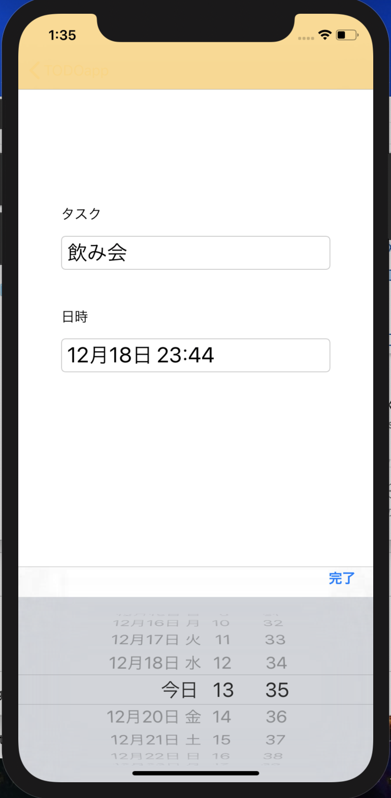

# TODOapp
Todo管理ができるシンプルなアプリ

## Overview
シンプルでわかりやすいTodo管理アプリです。 
TableViewではTodoを追加、管理。 
Cellをタップすると編集、時間設定ができます。 

|一覧|追加|編集|
|:--:|:--:|:--:|
||||

## Description
データの管理はFirebaseのFirestoreを使用してデータを管理しています。 

## Requirement
Firebase Firestore 

## Author
iOS Developer 
Kazuma Noha
